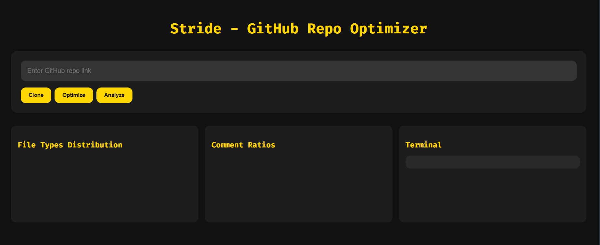
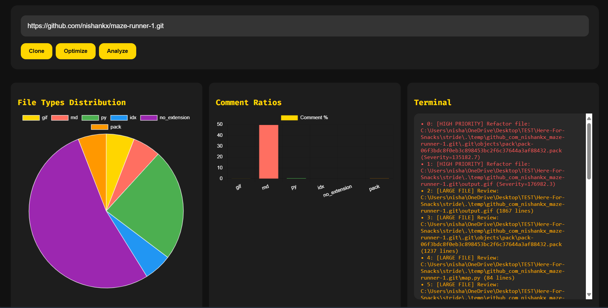
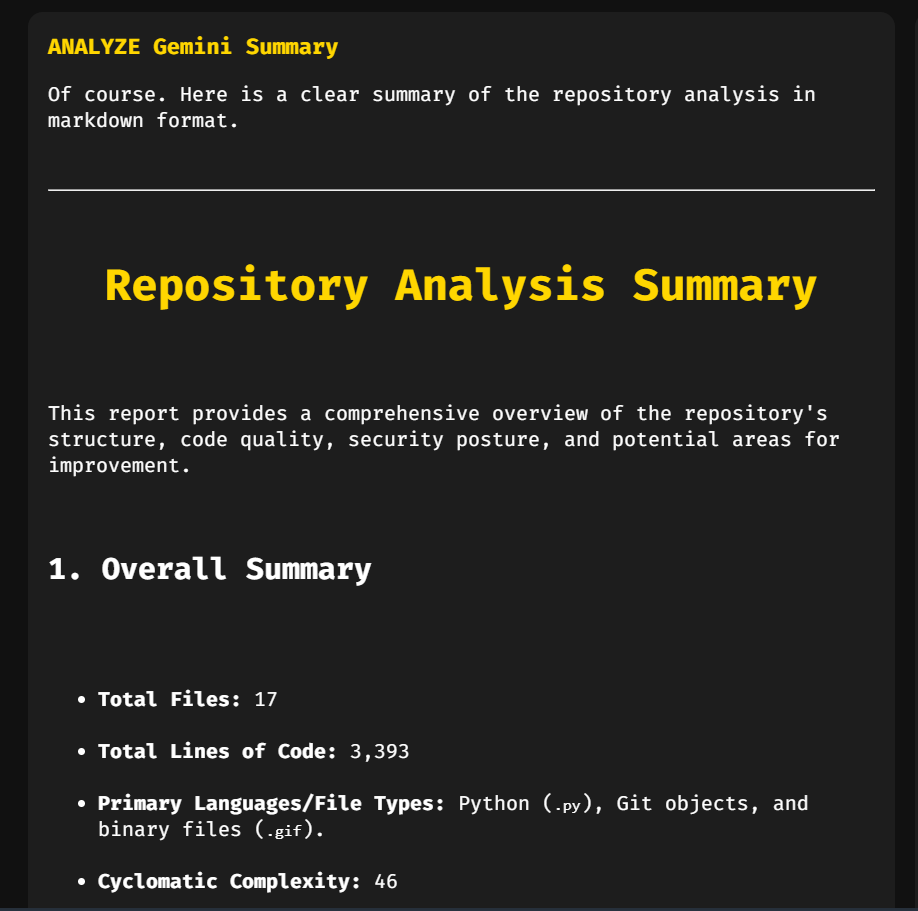
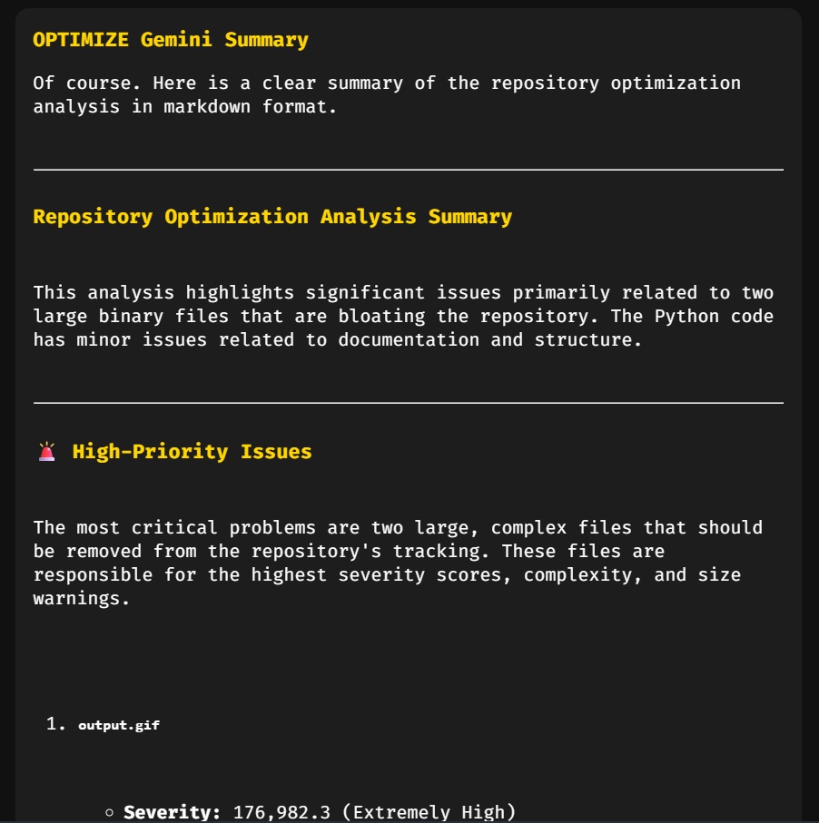

# Stride - The GitHub Repository Optimizer
- Stride is a modern developer assistant that allows you to clone, analyze, and optimize Git repositories in one place.
- Provides actionable suggestions and metrics to improve code quality and maintainability.
- Features a minimalistic, full-width frontend terminal for running commands and interacting with repositories.
- Displays analysis and optimization insights side-by-side for clear, immediate understaning.
- Organizes each repository in a uniquely named folder based on its metadata for easy tracking.
- Designed for speed, clarity, and scalability, offering a sleek interface while handling complex repo operations efficiently.

---
<!-- First two images stacked -->
<!-- First two images stacked -->
# Initial Interface

# Post-Processing

# Summaries
<!-- Last two images side by side and centered -->
<table align="center">
<tr>
  <td></td>
  <td></td>
</tr>
</table>
